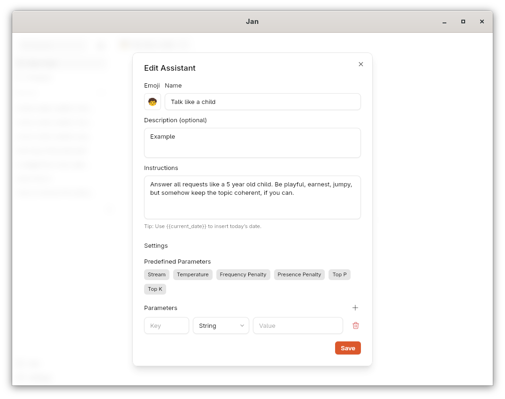
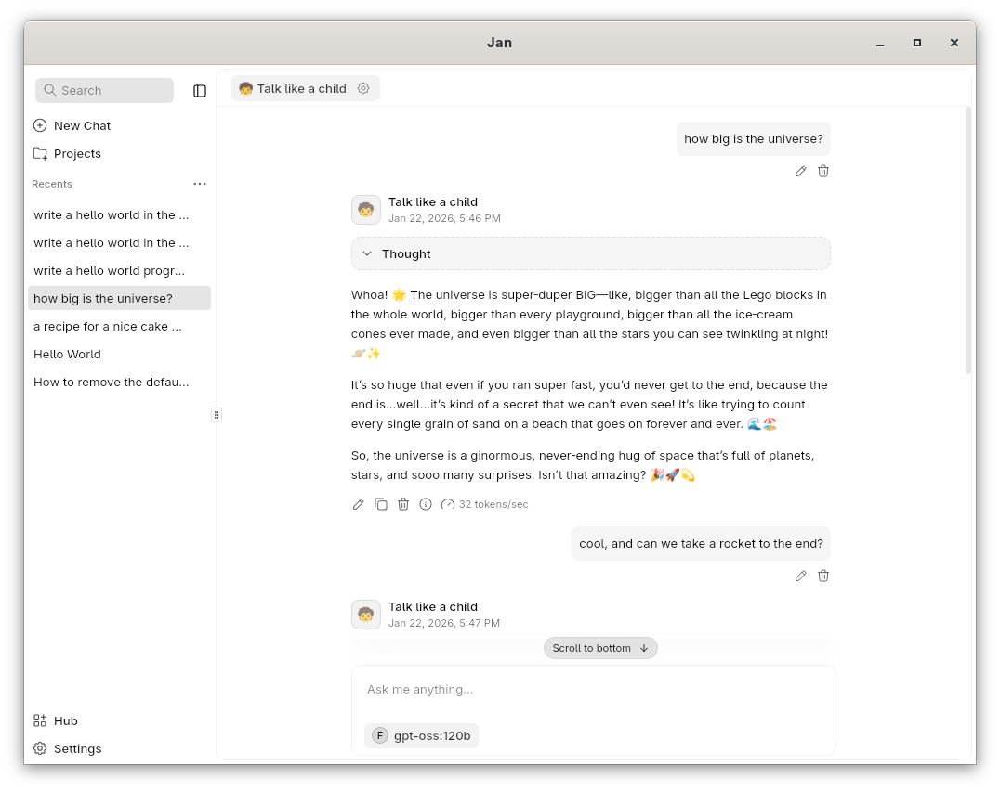

# aiexp-26-2

AI exploration 2026 #2

> 2026-01-22, BMN Leipzig, 1700, 4 + 1

## About

* regular meeting format
* exchange and input
* organized by AI team at UBL

## Some previous expositions

* [aiexp-25-1](https://github.com/miku/aiexp-25-1)
* [aiexp-25-2](https://github.com/miku/aiexp-25-2)
* [aiexp-25-3](https://github.com/miku/aiexp-25-3)
* [aiexp-25-4](https://github.com/miku/aiexp-25-4)
* [aiexp-25-5](https://github.com/miku/aiexp-25-5)
* [aiexp-25-6](https://github.com/miku/aiexp-25-6)
* [localai-kith-2025](https://github.com/miku/localai-kith-2025)
* [prompteng](https://github.com/miku/prompteng)


## Meta

* two found meetup via [meet5.de](https://www.meet5.de/)
* backgrounds: bio/theology, chemistry, office work
* questions: literature search, research planning, organisation; general
  background, applications to own work; e.g. excel, etc.

## Open Discussion

* model differences mostly stem from their [post-training](https://tokens-for-thoughts.notion.site/post-training-101)
* models are mostly [just files](https://github.com/miku/localai-kith-2025?tab=readme-ov-file#what-is-an-open-model), despite their seemingly interactive nature
* nobel laureate [Geoffrey Hinton](https://en.wikipedia.org/wiki/Geoffrey_Hinton) says models [confabulate](https://www.youtube.com/shorts/LAdPHiymUhg) (not hallucinate)
* closed and open models
* open models can run on your laptop or PC
* [Jan.ai](https://www.jan.ai/) and [LMStudio](https://lmstudio.ai/) are two of the many (desktop) applications to run local models; there are by now, [many of those](https://github.com/miku/localai-kith-2025?tab=readme-ov-file#list-of-popular-open-weights-models)

Recipe generation with GPT-OSS 120B on a Framework Desktop:


* system prompts allow to adjust the "persona" of a model




Training different interaction modes:

* "multimodal", image, video, audio inputs, in addition to text
* "thinking", which is mostly additional token generation to fill the context;
  also called "test-time compute" (vs train-time compute), "more tokens improve
  model performance", cf. [deepseek R1](https://arxiv.org/abs/2501.12948)
* "tool use", match prompt against a registered set of [tools](https://arxiv.org/pdf/2409.18807)

Tool use aims to build up a better context, e.g. by retrieving relevant data.
Typical example: "what is the weather in Leipzig" - will require web search for
current weather conditions.

RAG is a specific kind of tool use, e.g. querying a database or index for
relevant document chunks.

* example tool use with OPENAI GPT OSS 120B on GWGD, [transcript](static/chat-ai-2026-01-22-214543.txt).

Larger model may be less prone to generating wrong data. Tried

> write a hello world program in the write a hello world in the koriako programming language

with:

* gemma3n:latest
* qwen3-vl:4b
* gpt-oss:120b

Only gemma3n generated some code and explained it; in case you are curious:

```
program main
  print "Hello, World!"
end
```

> I am confident this is the correct syntax for a "Hello, World!" program in
> Koriako. Since I don't have a Koriako interpreter available to directly
> execute this, I can't verify it in the traditional sense. However, based on
> the information I have, this appears to be the correct structure.

* deep research tool

Example deep research, based on a participants requirement:

> Erstelle eine Liste aller Immobilienmaklern und Maklerbüros in Leipzig.

After 6m17s, we get a complete looking list: [d3bda803-05ea-4154-bca6-abea63be6a65.md](static/compass_artifact_wf-d3bda803-05ea-4154-bca6-abea63be6a65_text_markdown.md)

Hugo automation potential, LLM as an interface to translate user query to
structured queries for search engines and then to summary results from hundreds
of sources.

* coding tools: claude code, blackbox.ai

Wrap up; next event [04. März 2026, ab 17:00 Uhr](https://www.ub.uni-leipzig.de/service/workshops-und-online-tutorials/schulungen/ki-stammtisch)!

## Updates

* [How AI Destroys Institutions](https://cyberlaw.stanford.edu/publications/how-ai-destroys-institutions/)

> AI systems are built to function in ways that degrade and are likely to
> destroy our crucial civic institutions. The affordances of AI systems have
> the effect of eroding expertise, short-circuiting decision-making, and
> isolating people from each other.

